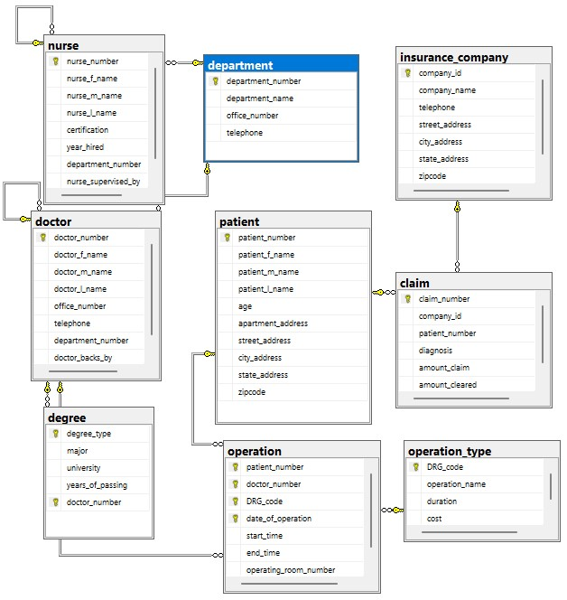
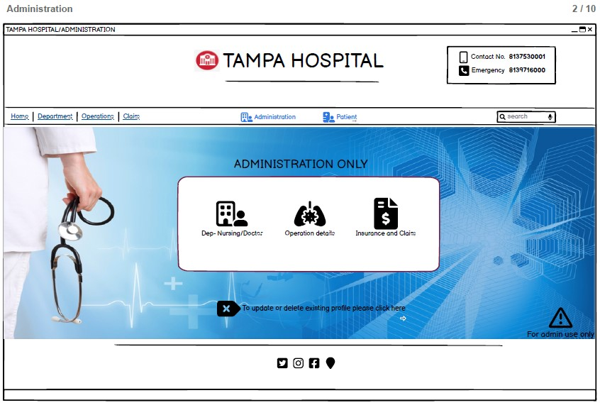

# Hospital-Management-using-SQL
<u>Efficient Hospital Management: Creating a Scalable SQL Database and
Wireframes</u>

Here, I developed a Hospital Management System SQL database and
wireframes. The project involved creating a complete SQL database and
wireframe for a Hospital Management System. To ensure that the SQL
database was efficient and scalable, I implemented various normalization
techniques and joins to improve query processing efficiency. Indexing
and query optimization were also implemented to allow for faster data
retrieval and improved overall performance of the Hospital Management
System. The project showcases my skills in preparing Entity Relationship
Diagrams, Advanced Database Management Systems, SQL, and website
wireframing. The Hospital Management System SQL database and wireframe
project exemplifies my proficiency in designing efficient and scalable
database systems to ensure fast retrieval of data and an enhanced user
experience.

Additionally, as part of the project, I have included two images to
provide a better understanding of the system. The first image is for the
Administrative wireframe page for the Tampa Hospital, which was designed
based on the Entity Relationship Diagram (ERD) of the database. 

This wireframe page provides a user-friendly interface for
administrators to manage patients, doctors, and appointments
efficiently. The second image shows the ERD of the Hospital Management
System database, which was designed using various normalization
techniques to ensure data integrity and consistency. The project
highlights my expertise in designing and implementing efficient and
scalable databases for real-world applications in the healthcare
industry. By designing the administrative wireframe page for the Tampa
Hospital linked based on the Entity Relationship Diagram of the
database, I have shown how effective planning and organization of
website wireframes can enhance the overall performance and functionality
of the database. This project highlights my skills in implementing
various optimization techniques and producing scalable databases that
can improve the efficiency of Hospital Management Systems.

